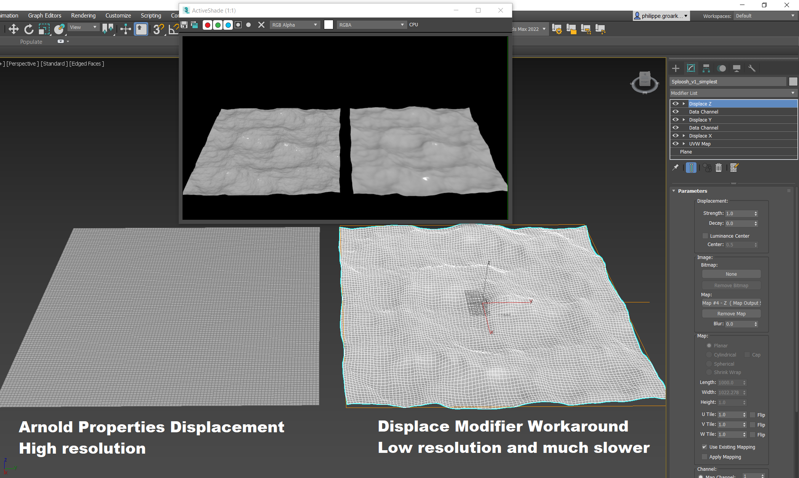

# SimpleOcean
SimpleOcean is a Gerstner Wave implementation to simulate ocean vector displacement. It isn't highly complex, but should do the job when you need a quick & dirty ocean. The shader outputs a main vector displacement map and multiple utility maps, like foam maps, above sea map, etc.

 
 

## Getting Started
- Create a Plane of reasonable size. Use the UVW Map modifier and check "XYZ to UVW".
  - The shader works in UV space, so as long as your object has a good UV mapping, you should be good to go.
- Connect the main output to **Arnold Properties Vector Displacement** map input.
  - This is important, as the shader outputs vector displacement which isn't compatible with some displace inputs (like Displace modifier).
- Use Active Shade to see the results.

## Known Issues
- Animation doesn't work in 3ds Max < 2023.
  - There is currently a bug with the Arnold Properties Displacement map input. Once that is fixed I can test animation.
- Most Max "Displacement" inputs do not accept Vector Displacement. So out-of-the-box, the displacement will not work with things like the Displace Modifier. There is a workaround however, explained [here](#running-in-modifier-stack).
- When using very large maps, the ocean generation can be slow.
- Some of the hashing options aren't ideal and produce banding.

## Material Settings
The following should create a decently shaded ocean. For best results use and HDRI environment. You can place a large dark plane underneath the ocean, which improves realism a little bit. A more in-depth video is coming to discuss node details.

### Arnold Properties
- Displacement > Enable
- Displacement > Bounds pads : 1.0
- Displacement > Use Map
- Connect Displacement output to that map.

Not recommend, Autobump replaces subdiv and is much much much faster.
- Subdivision > Catclark
- Subdivision > Iterations : about 2-3

### Arnold Standard Surface Setup
- Diffuse : 0
- IOR : 1.33
- Specular : ~1
- Transmission : 1
- Transmission Color : ~blue
- Transmission Depth : 0.1+
- Scatter : White (or other color)
- Scatter Anisotropy : 1

## Running In Modifier Stack

Thanks to Paul E.'s suggestion, I was able to create a scene setup to drive the Displace modifier with the map output. Using the modifier stack is very slow and less precise, since we don't have Arnold Autobump. However, if you need interactions with scene objects, an approximation of the ocean will allow you to do so.

[Download Example Scene](img/simpleocean_displace.max?raw=true)

### Instructions
To accomplish this, we will split the output displacement into its x, y and z components. We can do this in the Material Editor using an OSL Vector Components node. With these components, we can now drive 3 different Displace modifiers to apply the effect to our modifier stack. After the first 2 Displace modifiers (X and Y), we will use the Data Channel Modifier to apply the correct axis displacement.

1. Split the SimpleOcean Displacement output using the OSL Vector Components node.
2. After your Plane and UVW Map modifiers, add a Displace modifier.
3. Connect the X axis to its Map input and check "Use Existing Mapping".
4. Next, add a Data Channel modifier.
5. Add 1 Vertex Input Operator and 2 Vertex Output Operators. Set them up as follows.
6. Vertex Input : Position, Z.
7. Vertex Output 1 : Position, X, Add.
8. Vertex Output 2 : Position, Z, Substract.
9. Repeat step 2 to 8 for the Y axis. Make sure you use the Y axis as an input to the Displace modifier, and as Vertex Output 1 (step 7).
10. Finally, add the third Displace modifier. Connect the Z axis, and your done! No need for a Data Channel Modifier on the Z axis.
